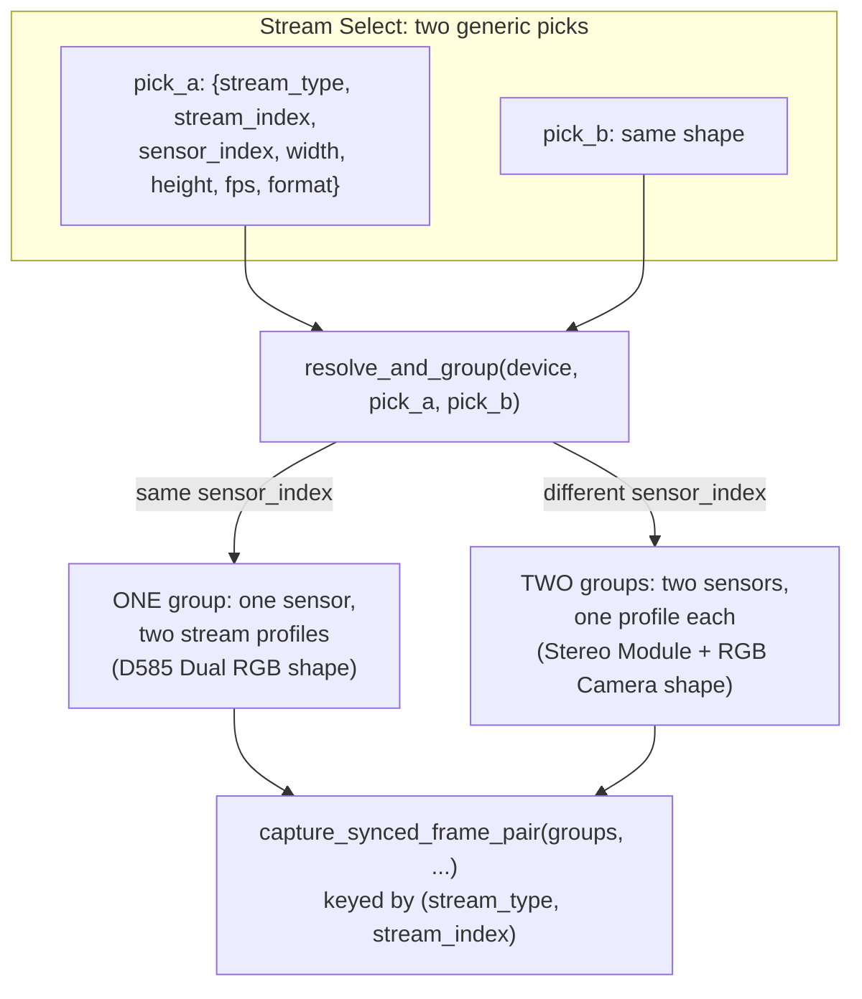

# CLAUDE.md

This file provides guidance to Claude Code (claude.ai/code) when working with code in this repository.

## What this is

A PySide6 desktop wizard app for measuring timing sync between ANY two video streams a connected Intel RealSense camera offers - two IR streams, IR+color, or two color streams on a Dual-RGB device - against an Image Engineering LED panel. It generalizes a sibling project that hardcoded a single IR-vs-RGB pairing (see "`resolve_and_group`..." below) into a wizard where the operator picks "Stream A" and "Stream B" from whatever the device actually reports. It replaces three standalone scripts (in the sibling `optical_sync_poc_/` directory, which this repo ports/lifts logic from) with one guided flow: Device Select -> Stream Config -> ROI Select -> Calibration -> Threshold Tuning -> Live Session.

## Commands

```powershell
# Setup (Windows, Python 3.10+, developed against 3.13)
python -m venv .venv
.venv\Scripts\pip install -r requirements.txt

# Run the full test suite (works with no hardware connected)
.venv\Scripts\python.exe -m pytest -v

# Run a single test
.venv\Scripts\python.exe -m pytest tests/domain/test_running_stats.py::test_mean_of_single_value -v

# Run the app (requires a connected RealSense camera + LED-Panel.exe on PATH past Device Select)
.venv\Scripts\python.exe main.py
```

`pytest.ini` sets `pythonpath = .` and `testpaths = tests`, so `pytest -v` from the repo root works without installing the package. GUI/widget tests construct real Qt objects; on a machine/CI runner with no display, set `QT_QPA_PLATFORM=offscreen` first (the GitHub Actions workflow in `.github/workflows/tests.yml` does this on `windows-latest`). Widget tests share one `QApplication` instance via the session-scoped `qapp` fixture in `tests/conftest.py`.

## Architecture

### Layering: `domain` -> `engine` -> `gui`, plus `state`

- **`domain/`** - pure image/math/calibration/export logic. No Qt, no `pyrealsense2`. Fully unit-tested with plain numpy arrays.
- **`engine/`** - hardware and live-session orchestration. Splits into a pure-Python core and a thin hardware/Qt shell:
  - `engine/metrics.py` (`PairingGapMetric`, `PositionGapMetric` - the `Metric` ABC), `engine/test_session.py` (`TestSession` - start/stop/buffers rows), `engine/acquisition_loop.py` (`AcquisitionLoop` - drives one frame-pair at a time through the metrics) are all pure Python, unit-tested with fakes.
  - `engine/streams.py` is hardware-facing and generic: `list_video_stream_options`/`list_video_stream_options_from_device` enumerate every infrared/color video-stream profile a device offers as plain picker dicts (no hardcoded "Stereo Module"/"RGB Camera" sensor-name filtering), `resolve_and_group` unifies the two-picks-into-sensors problem (see below), `capture_synced_frame_pair` drives one-shot settled captures (ROI select, calibration) off a `groups` list, and `ContinuousCapture(device_serial, pick_a, pick_b)` drives the open-ended `rs.pipeline()`-based stream the live preview and live session both need. Most of this file's logic (`resolve_and_group`, `capture_synced_frame_pair`, `list_video_stream_options_from_device`, `stream_slug`, the camera-control setters, etc.) is pure enough to unit-test against fake sensor/device objects and has substantial coverage in `tests/engine/test_streams.py` - only `ContinuousCapture`'s real-`rs.pipeline()` internals are genuinely untested by design (hardware-only). `engine/led_panel.py` (`LEDPanel`, a static-method wrapper around the `LED-Panel.exe` CLI) and `engine/session_engine.py` (`SessionEngineThread`, a `QThread`) round out the hardware-facing layer and have NO automated tests by design - see the "Live Session pipeline" section below and the README's Project Structure note.
- **`gui/`** - PySide6 wizard pages (`gui/pages/`) and reusable widgets (`gui/widgets/`), wired together by `gui/main_window.py` (`MainWindow`, a `QStackedWidget` driving the 6-page flow and persisting choices to `state.gui_state`).
- **`state/`** - `GuiState`, the wizard's own persisted state (`gui_state.json`: last device, `stream_a_*`/`stream_b_*` resolution/fps/ROI/camera-control fields). Separate from `settings.yaml` on purpose - see Configuration files below.

When extending a metric or the live session's data flow, start from `engine/metrics.py`/`engine/test_session.py` (pure, testable) and only touch `engine/session_engine.py` for the hardware/Qt plumbing.

### `resolve_and_group`: unifying "two sensors" and "one sensor, two streams"

Every stream pick (`engine/streams.py`'s `list_video_stream_options`) is a plain dict: `sensor_index`, `stream_type` (an `rs.stream` enum member - `infrared` or `color`), `stream_index`, `width`, `height`, `fps`, `format`. Stream Config produces two of these, `pick_a`/`pick_b`, entirely independently - nothing about the picker knows or cares whether they'll end up on the same physical sensor.

`resolve_and_group(device, pick_a, pick_b)` is the one function that resolves that question and unifies the two camera topologies this project subsumes as special cases:



If `pick_a`/`pick_b` share the same `sensor_index`, they resolve to ONE physical sensor object with two stream profiles opened on it together (the shape a D585-style Dual RGB camera needs - two color streams sharing a sensor). If they differ, they resolve to TWO distinct sensor objects (the traditional Stereo Module + RGB Camera shape - IR vs. color, or IR vs. IR on two separate stereo sensors). This matters because `sensor.open()`/`.start()` must be called once per distinct sensor object with all of that sensor's wanted profiles passed together, not once per stream pick. Everything downstream (`capture_synced_frame_pair`, camera-control application) works off this `groups` list, keyed internally by `(stream_type, stream_index)` tuples rather than `stream_type` alone, since two picks can share a stream type.

`gui/pages/stream_config_page.py`'s `group_camera_controls` mirrors this exact same-sensor-index grouping logic for UI layout purposes only, before any live device handle exists (it decides how many "Camera Controls" group boxes to show, purely from the two picks' `sensor_index` fields).

### Camera controls (emitter/exposure), applied once per resolved sensor

Camera controls - `set_emitter_enabled(sensor, enabled)`, `set_manual_exposure(sensor, exposure, gain)`, `enable_auto_exposure(sensor)`, all in `engine/streams.py` - are applied once PER DISTINCT RESOLVED SENSOR (i.e. once per `resolve_and_group` group), not once per stream pick, since two picks might share a sensor. Stream Config's UI presents one "Camera Controls" group box per `group_camera_controls` group: an IR-emitter-disable checkbox (shown only if the group includes an infrared stream) plus an auto/manual exposure+gain radio-button pair, read back as `camera_controls` (a list of `{sensor_indices, emitter_enabled, auto_exposure, exposure, gain}` dicts, position-aligned with `resolve_and_group`'s own group order) at "Next".

That `camera_controls` list is applied from four separate call sites, each of which re-derives `groups` via its own `resolve_and_group(device, pick_a, pick_b)` call and zips it against `camera_controls` position-for-position: `gui/pages/roi_select_page.py`'s `_apply_camera_controls` (used by both ROI Select and, imported directly, by `gui/pages/calibration_page.py`), and `engine/session_engine.py`'s `SessionEngineThread.run()` and `engine/threshold_preview_thread.py`'s `ThresholdPreviewThread.run()` (each duplicated inline rather than imported, since these are hardware-thread files, not GUI code).

**`enable_auto_exposure` must undo everything `set_manual_exposure` wrote, not just the auto flag - but ONLY when actually coming FROM manual.** `set_manual_exposure` writes THREE options (`enable_auto_exposure=0`, `exposure`, `gain`); `enable_auto_exposure` therefore restores `exposure`/`gain` to the sensor's own `get_option_range().default` BEFORE switching auto back on (that order matters - on some sensors writing `exposure` while auto is on implicitly turns auto back off). An earlier version flipped only the auto flag, so a manual->auto round trip in Stream Config left the manually-set gain (the UI defaults it to 16) still written into the camera: dark enough that Calibration's Otsu blob detection stopped finding LEDs at all, and - because the value lives in the CAMERA, not the app - it survived app restarts, so only a power-cycle/`hardware_reset` cleared it.

The was-manual gate (`sensor.get_option(rs.option.enable_auto_exposure) == 0`, checked BEFORE restoring) is itself a fix for a second, subtler regression: `enable_auto_exposure` is called unconditionally on EVERY apply point (ROI Select, Calibration, Threshold Tuning, Live Session) whenever "Auto exposure" is selected - not just on an actual Manual->Auto transition. An intermediate version restored the defaults unconditionally every time, including when the sensor was ALREADY auto-exposing correctly - forcing a cold reset-and-reconverge on every single Calibration/ROI Select run, which could leave exposure under-converged within `calibration.settle_frames`' short window even though it would have stayed correctly exposed if left alone. Symptom on real hardware: scattered, intermittent LED detection dropouts on every run, not the original bug's total blackout - a regression that came back even when the operator never touched Manual exposure at all. Gating the restore on the sensor's OWN currently-reported state leaves an already-auto sensor completely undisturbed (byte-for-byte the pre-fix flag-only behavior for that case) while still self-healing the actual Manual->Auto transition.

Restoring the SDK-reported factory default (rather than snapshotting the pre-app value) keeps the function stateless and matches what a power-cycle workaround actually gives you; auto-exposure re-derives its own working value immediately after, so the restored default is only ever a starting point. `tools/camera_diag/reset_camera_exposure.py` calls this same function directly as a one-off, software-only alternative to a physical power-cycle for a sensor already stuck from before this fix existed.

### IR/RGB sync depends on stream OPEN order, not `enable_stream()` call order

Real-hardware finding: `rs.pipeline()` gives **no control** over the order it internally *opens* the two sensors, and `config.enable_stream()` call order does **not** influence that internal open order at all - an earlier `ContinuousCapture` experiment (`color_stream_first`, reordering the `enable_stream()` calls) was aimed at this exact assumption and, tested on real hardware, changed nothing. What DOES change: whether RGB or IR gets opened first decides whether the two streams come out synchronized - RGB-before-IR produced a fixed ~11.3ms inter-sensor HW-timestamp offset on the rig this was found on; IR-before-RGB measured the true ~3.5ms. This matches Intel's documented firmware requirement that depth and IR be configured together - enabling IR alone leaves the pipeline to satisfy that requirement internally, in an open order we can't see or control.

The fix, confirmed on real hardware: co-enable the stereo module's **depth** stream alongside IR+RGB, which syncs them regardless of open order. `ContinuousCapture(..., enable_depth_for_ir_sync=True)` (the default) does this via `_depth_sync_stream()` (returns the depth geometry to enable - the first infrared pick's own width/height/fps, `None` for a color+color/Dual-RGB pairing with no stereo module in play, or when the setting is off) and `_build_config()`. `start()` builds ONE config (depth included whenever `_depth_sync_stream()` returns something) and starts it directly, on purpose with **no `can_resolve()` pre-check or no-depth fallback** - an earlier version added exactly that speculative probe-then-fallback and it silently undid the fix on real hardware: `can_resolve()` returned a false negative for a combination `pipeline.start()` itself handled fine, so the fallback branch fired every run with no error raised, indistinguishable from the fix never having been applied at all. If a config genuinely can't start, let `pipeline.start()` raise - a real error reaching the operator beats a silent, wrong fallback. `depth_sync_active` just records whether depth was REQUESTED (not resolved/succeeded), for callers that want to report it.

**This costs USB bandwidth** - z16 depth at 1280x720@30 is ~55 MB/s on top of IR (~28 MB/s) and bgr8 color (~83 MB/s), and measurably increased frame drops on real hardware - so it stays a `settings.yaml` `camera_sync.enable_depth_for_ir_sync` toggle (threaded through Stream Config's own pairing-quality preview, Threshold Tuning, and Live Session - all three need to agree, or the preview pages would show a different inter-sensor offset than the run they're meant to be previewing) rather than an unconditional default. If bandwidth is the binding constraint, `camera.stream_options`' color format is a cheaper first lever than turning this off entirely - see that setting's own comment in `settings.yaml`.

### Per-stream `config.yaml` slug keying

`config.yaml`'s LED positions are keyed per-stream by a slug (`engine/streams.py`'s `stream_slug(pick)`, e.g. `"infrared1"`, `"color"`, `"color2"` - `stream_index` 0 is omitted from the slug so a single-RGB camera's slug still just reads `"color"`) nested under the camera name, via `domain/calibration.py`'s `update_config_leds`/`load_led_positions`. This is simpler than a joined pair-key (e.g. `"infrared1_color"`): each stream's calibration data stands on its own, so recalibrating one stream of a pair doesn't invalidate the other's saved positions, and the same `"color"` slug's data is reusable across different Stream-A/Stream-B pairings that both happen to include it.

### Optional dual-LED-panel mode (manual operator toggle, not camera/test-driven)

Some rigs run two physically separate LED panels instead of one - one per
camera stream, since IR and RGB (or two different IR sensors) are
physically separate, non-co-located sensors that can't both look at a
single panel from the same angle. Both panels share one Acroname USB hub
(only ONE panel's USB connection is visible to the OS at a time -
`LED-Panel.exe` always talks to whichever panel is currently hub-exposed,
never a specific one by identity) and one external USB relay that both
panels' trigger inputs are wired to (NOT the camera - nothing in this
codebase configures the camera to emit a hardware trigger). The relay is
a **gate, not a one-shot start pulse**: once both panels are configured
into trigger mode, they only keep stepping in lockstep WHILE the relay
stays closed (energized) - releasing it freezes both wherever they happen
to be. An earlier version of this code treated it as a brief ~0.2s
kickoff pulse (modeled on a reference demo script's `time.sleep(100)`
between closing/releasing it, wrongly assumed to be leftover debug timing
rather than load-bearing) - real-hardware testing confirmed that was
wrong: the hold time itself is what keeps the panels stepping.

`_relay_on` also starts a background thread (`_relay_keepalive_loop`) that
re-sends the same "ON" byte on the already-open connection every
`_RELAY_KEEPALIVE_INTERVAL_S` (30s) for as long as the relay stays armed -
a multi-minute test that holds the relay open but never writes to it
again until the final OFF byte was observed to sometimes fail on its NEXT
run, consistent with Windows USB Selective Suspend power-managing the
idle USB-serial adapter and not cleanly recovering. `_relay_off` stops and
joins this thread before it does anything else with the connection
(pyserial's `Serial` isn't documented as safe for concurrent access from
multiple threads).

This is a **manual operator choice**, not inferred from the camera model,
not auto-detected from the hub, and not a per-named-test `settings.yaml`
flag - Device Select's "Use dual LED panel" checkbox
(`gui/pages/device_select_page.py`) is read once in
`MainWindow._on_device_chosen` into `self._dual_panel_config` (`None` for
the normal single-panel case; `settings["dual_panel"]`'s port/COM-port
wiring dict otherwise), then threaded through every downstream page's
`set_context()` from ROI Select onward - unlike the single-panel case, a
single `LEDPanel.*` call only ever reaches whichever panel is currently
hub-exposed, so EVERY panel interaction (not just the actual timed test)
needs the hub-switching dance repeated for both panels. `settings.yaml`'s
`dual_panel.stream_a_panel_port`/`stream_b_panel_port` are keyed
explicitly by STREAM, not by an arbitrary "first panel"/"second panel" -
on the actual rig this was built for, stream_a (IR)'s panel is port 1 and
stream_b (color)'s is port 0, the reverse of what the naming might
suggest, so getting this mapping right matters once code depends on it
(see below).

`engine/dual_panel_control.py` centralizes all of this branching.
`turn_all_leds_on`/`turn_all_leds_off`/`start_scanning`/`stop_scanning`
each take a `dual_panel_config` and either call `engine/led_panel.py`'s
`LEDPanel` directly (the `None`/single-panel case, byte-for-byte the same
code path as before this existed) or route through
`_run_on_both_panels`/`_relay_on`/`_relay_off` (both panels together, for
callers that genuinely need them lit/dark/stepping in lockstep -
Threshold Tuning and Live Session's actual timed test). `_relay_on` keeps
its serial connection to the relay open at module level (rather than
threading a handle back through every `start_scanning`/`stop_scanning`
call site) and leaves the relay closed; `stop_scanning` is what calls
`_relay_off()` to actually release it. These lazily import
`engine/acroname_hub.py` (a ported `AcronameHub` wrapper around the
Acroname `brainstem` SDK) and `pyserial` respectively, so every normal
single-panel test can import/run this module without either dependency
installed. `start_scanning`'s dual-panel path configures each panel with
`LEDPanel.reset()` then `set_mode(1)`/`set_speed_ms()`/
`set_trigger_mode(2)`/`set_camera_trigger(True)` - deliberately
`set_mode(1)`, NOT `response_time_measurement_mode()` (which sends
`--stop` first) and deliberately no `set_direction_single()` either:
real-hardware testing confirmed that sending `--stop` before entering
trigger mode prevents the panel from actually stepping once triggered,
and the confirmed-working reference sequence
(`docs/config_tigger_mode.bat`) never sets direction. Don't add either
back without re-confirming on real hardware first.

**The "only steps once, or right after an interrupted run" bug and its
actual fix.** A run following one that completed NORMALLY never stepped
on its next arm, while a run following one that was INTERRUPTED before
`stop_scanning()` ran always did. A long investigation chased this from
the `start_scanning` side - trying `LEDPanel.start()` in 3 different
positions, forcing a real transition on `set_camera_trigger`/
`set_trigger_mode`, forcing a real transition on the relay itself - all
confirmed via `tools/dual_panel_diag/diag_panel_query_state.py` (queries `LED-Panel.exe`'s
own `--isRunning`/`--getCurrentLED`/etc., via a `pywin32`
`win32console`-based reader, since these commands write via the low-level
`WriteConsole` API and produce nothing under redirection - only works from
a real, native Windows console, not an IDE-integrated one) to make no
difference: `isRunning` never got set, and the panel never stepped.
`tools/dual_panel_diag/diag_arm_sequence_sweep.py` then automated an exhaustive sweep of
12 arm-sequence variants (each starting from a `stop_scanning()`-forced
"just stopped" precondition, detecting actual stepping automatically via
`getCurrentLED` changing between 2 samples) and confirmed NONE of that
`start_scanning`-side complexity ever fixed it - the only variant that
produced stepping was calling `--start` right after entering External
trigger mode, which free-runs the panel on its own internal clock
immediately, bypassing the shared relay trigger entirely and breaking
lockstep (since `configure_one_panel` runs separately per panel,
hub-switched one at a time - panel A would start well before panel B).

The actual root cause was never in `start_scanning` at all: it was
`stop_scanning`'s own `LEDPanel.stop()` call (`--stop`: "stop AND reset to
starting position"), which sets some internal panel state that nothing in
`start_scanning`'s arm sequence can undo. The fix - confirmed by comparing
against the original reference workflow (`docs/acroname_hub.py`'s
`__main__` demo), which "always works" specifically because it never
calls `--stop` at all - is that `stop_scanning`'s dual-panel path now
calls `LEDPanel.reset()` ("--reset": reset to starting position WITHOUT
stopping it) instead of `LEDPanel.stop()`. The relay release (which
`stop_scanning` already does first) is what actually freezes both panels
in place - a documented gate, not a one-shot pulse (see below) - so
`--stop`'s own "stop" behavior was always redundant here; `reset()` still
returns the LEDs to a clean starting position for the next run, just
without the poisoning. `start_scanning`'s own arm sequence is back to the
plain sequence above - none of the accumulated complexity was ever needed
once this was fixed at its actual source. Do not add `LEDPanel.stop()`
back into the dual-panel `stop_scanning` path without re-confirming on
real hardware first (`tools/dual_panel_diag/diag_panel_query_state.py`, checking
`isRunning` after the NEXT arm).

**The same poisoning, from a second call site the original fix never
covered: the panel would fail to step on its very FIRST arm after
Calibration/ROI Select specifically.** `LEDPanel.all_leds_off()`
(`engine/led_panel.py`) internally calls `LEDPanel.stop()` - i.e. sends the
exact same `--stop` identified above as the root cause - as its own first
step. Calibration's and ROI Select's per-stream capture code (the only two
callers of `switched_to_stream_panel`) both end their block by calling
`all_leds_off()` as cleanup, right before the hub switches away from that
panel. So every calibration run left both panels freshly poisoned, and the
very next `start_scanning()` (Threshold Tuning's first Start, right after
Calibration) would fail to step - while every LATER `start_scanning`/
`stop_scanning` cycle within that same Threshold Tuning/Live Session
session worked fine, since `stop_scanning`'s own `reset()` kept curing it
each time. Manually pressing Stop then Start again "fixed" it for the same
reason. `switched_to_stream_panel` now calls `LEDPanel.reset()` itself
right before disconnecting from the hub (while still switched to that
panel - no extra hub switch needed), un-poisoning both panels as part of
Calibration/ROI Select's own cleanup instead of leaving it to accidentally
depend on the operator's next `start_scanning()` call being preceded by an
explicit `stop_scanning()`.

**That `switched_to_stream_panel` fix alone did not fully resolve it on real
hardware - the panel still failed to step on its first arm.** The reason:
`tools/dual_panel_diag/diag_arm_sequence_sweep.py`'s exhaustive 12-variant
sweep - the investigation that found the `--stop`->`--reset` fix above -
always forced its test precondition via `dual_panel_control.stop_scanning()`
itself (see that script's own `run_variant`). Every variant it ever tested,
including plain `reset()`, was validated ONLY against a panel that had
PREVIOUSLY been armed into response-time-measurement mode (mode 1, trigger
mode 2) and then stopped. It was never tested against the precondition that
actually exists here: a panel that has NEVER been in mode 1 at all, coming
straight from Calibration's `all_leds_on()`/`all_leds_off()` (modes 5 then
3 - a different, unvalidated transition). The `switched_to_stream_panel`
fix was the direct equivalent of the sweep's own `reset_then_baseline`
variant, just applied to a precondition that variant was never actually
tested against.

The actual fix: `start_scanning()`'s dual-panel branch now calls
`stop_scanning(dual_panel_config)` itself, unconditionally, before its own
`configure_one_panel()`/`_relay_on()` - i.e. it automates "press Stop then
press Start", the operator's own confirmed-100%-reliable manual recovery,
rather than guessing a brand new arm sequence blind for a transition
nothing has actually swept. Safe to call even when nothing was ever armed:
`_relay_off()` no-ops when the relay was never on, and sending an extra
`reset()` to an already-reset panel is harmless (confirmed safe by the
sweep's own `reset_twice_then_baseline` variant). This also makes
`gui/pages/threshold_tuning_page.py`'s `_on_confirm_switch_time_clicked` -
which re-runs `start_scanning()` without an intervening `stop_scanning()` -
correct by construction instead of only working via `_relay_on()`'s own
stale-connection guard. Keep the `switched_to_stream_panel` fix too - it's
still correct on its own terms and cheap, genuine defense-in-depth alongside
this one, not a replacement for it.

**This `stop_scanning()`-inside-`start_scanning()` fix ALSO did not resolve
it on real hardware** - confirmed by the operator, still fails to step on
the first arm after Calibration. Two informed guesses in a row, both
pattern-matched from the ORIGINAL bug's fix, have now both failed against
this specific untested transition. Per this project's own established
lesson from the original investigation ("Rather than keep hand-editing
`start_scanning()` and asking for one more real-hardware round trip per
idea, this sweeps a whole list of VARIANTS in one unattended run") -
guessing a third sequence by hand is not the right next move.

`tools/dual_panel_diag/diag_first_arm_after_calibration.py` adapted
`diag_arm_sequence_sweep.py`'s proven harness with the precondition step
corrected to the REAL one - `switched_to_stream_panel()` +
`LEDPanel.stop(); LEDPanel.all_leds_on(); LEDPanel.all_leds_off()` per
stream, byte-for-byte matching `_capture_on_off_for_stream()` - and swept 8
candidate single-shot arm sequences from it, including the current shipped
`start_scanning()` as a negative control. **Result on real hardware: ALL 8
showed "no movement", including the negative control** (confirming the
script's own precondition/detection was valid). Raw per-variant output
showed something precise: `isRunning` read `'1'` on both panels right
after the precondition (before any arm attempt), then `'0'` after EVERY
single arm attempt - the exact signature already documented above for the
original bug before its fix, now showing up via this different,
never-swept route too.

**The actual fix, confirmed via `tools/dual_panel_diag/diag_double_arm_hypothesis.py`:**
across BOTH sweeps (12 old variants + 8 new = 20 single-shot sequences
total), the one thing never tested was genuinely arming TWICE, with a real
`stop_scanning()` in between, using the IDENTICAL command sequence both
times - which is inherently what the operator's own 100%-reliable manual
fix (Start, fails, Stop, Start again, works) does. That script forced the
real precondition once, then called the current shipped `start_scanning()`
(arm #1), then a real `stop_scanning()`, then `start_scanning()` again
(arm #2 - the exact same call), capturing the full 8-field query
(`isRunning`/`getCurrentLED`/`getMode`/`getTriggerMode`/`getCameraTrigger`/
`getCameraTriggerState`/`getStopTrigger`/`getStopTriggerState`) at each
checkpoint. **Arm #1: no movement, `isRunning='0'`, but
`getCameraTriggerState='1'` - the panel DOES see the relay's trigger edge
electrically, exactly matching this file's own earlier note ("this
relay-edge guarantee is confirmed harmless/correct... but is NOT sufficient
on its own"). Arm #2 (identical command sequence): STEPPED on both panels,
`isRunning='1'`.** Two identical arm sequences, one difference - having
already gone through one full relay close->open cycle. Sequence CONTENT
was never the variable that mattered across all 20 single-shot variants
tried in this investigation; the panel's own trigger-detection logic
needs to see one full "priming" cycle before it trusts the next one.

`start_scanning()`'s dual-panel branch arms TWICE - `_arm_once()` (configure
both panels + close relay), a real `stop_scanning()`, then `_arm_once()`
again - directly encoding this confirmed sequence, but **only on the FIRST
arm since Calibration/ROI Select last touched the panels**, tracked via a
module-level `_dual_panel_primed` flag. Unconditionally double-arming on
EVERY `start_scanning()` call (switch_time changes, Continue to Live Test,
Live Session's own Start - none of which need it) made every one of those
calls noticeably slower for no benefit, confirmed on real hardware -
the bug was never "every Start is slow to arm", only the very first one
after Calibration. `switched_to_stream_panel`'s own cleanup (the one place
both Calibration's and ROI Select's per-stream capture code route through)
sets the flag back to `False` on exit, since that's the actual de-priming
action (their `all_leds_on()`/`all_leds_off()` calls inside the `with`
block); `start_scanning()` sets it `True` after a successful double-arm.
Resets to `False` on a fresh process by default - the safe choice, since a
fresh process has no evidence either panel is primed.

**A second layer on top of that: once primed, a call with the SAME
`switch_time_ms`/`scan_direction` as last time skips reconfiguring the
panels entirely and just re-triggers the relay.** `_dual_panel_primed`
also tracks the last-armed settings. `configure_one_panel()`'s own
`LEDPanel.reset()` only ever resets LED POSITION, never mode/trigger
config - a panel already sitting in mode 1/trigger mode 2/camera-trigger-
enabled from the last arm is still fully configured, so the only thing
that actually needs to happen for a plain repeat-Start is re-triggering
the relay (a direct serial connection, not the Acroname hub - no
hub-switch settle time at all). What actually dominates `start_scanning()`'s
wall-clock cost is the per-panel HUB SWITCH, not the handful of
near-instant LEDPanel CLI commands sent during it - so skipping the hub
switch entirely, not just trimming which commands get sent during it, is
what makes this fast. Trade-off: the LEDs resume stepping from wherever
they last stopped rather than restarting at position 0, since the reset()
that normally does that is skipped too - acceptable since nothing in this
app depends on a scan always starting from LED 0. A genuine settings
CHANGE (or the first arm since Calibration) still needs the full
reconfigure.

Any GENUINE panel config change (switch time actually different from last
time) needs the full provisioning re-run - see `gui/pages/threshold_tuning_page.py`'s
`_on_confirm_switch_time_clicked`, which branches on `dual_panel_config` to
either call `LEDPanel.set_speed_ms()` directly and instantly (single-panel)
or re-run `start_scanning()` (dual-panel - fast if the settings match what's
already configured, a full reconfigure otherwise); since this re-runs
`start_scanning()` without an intervening `stop_scanning()`, `_relay_on()`
closes any stale still-open connection from a previous call before opening
its own.

**The switch-time spinbox applies on an explicit Confirm click, not on
every `valueChanged` tick.** It used to call
`start_scanning()`/`LEDPanel.set_speed_ms()` live on every tick - so
clicking the spin arrows from 1 to 5 fired 4 separate hardware calls
(one per intermediate value) instead of one for the value actually wanted.
Worse: the handler calls `QApplication.processEvents()` mid-body so its
own "Reconfiguring..." status-label update repaints before the blocking
call - which also let a *second* queued tick re-enter the handler while
the first was still mid-flight. `engine/dual_panel_control.py`'s
`_relay_connection` (the one open `serial.Serial` handle to the relay's
COM port) had no lock protecting it from concurrent access - two
overlapping attempts to open/write the same COM port produced, on real
hardware, `Failed to update LED switch time: WriteFile failed
(PermissionError(13, 'Access is denied.', ...))`.

`switch_time_spinbox.valueChanged` now only toggles a "Confirm" button's
enabled state (comparing against `_last_applied_switch_time_ms`) - no
hardware call. `confirm_switch_time_button.clicked` is what actually
applies, collecting however many ticks happened since the last confirm
into exactly one hardware call with the final settled value. The apply
itself disables the spinbox, Confirm, and `start_button` for its own
duration (restoring `start_button` to whatever it already was, not
unconditionally enabling it, since a preview already running keeps it
disabled independently) - since the whole call is synchronous on the GUI
thread, this structurally prevents the reentrancy that caused the bug
above: Confirm cannot be clicked again until the first call returns, even
though `QApplication.processEvents()` still runs mid-call for the
status-label repaint. A failed apply leaves `_last_applied_switch_time_ms`
untouched, so Confirm stays enabled for an easy retry with no need to
nudge the spinbox first.

`engine/dual_panel_control.py` also gained a module-level `_dual_panel_lock`
(a `threading.RLock` - re-entrant because `start_scanning`'s dual-panel
branch already calls `stop_scanning()` internally) wrapping both
functions' dual-panel bodies, as defense-in-depth for any future caller.

**That lock alone was NOT enough - confirmed on real hardware.** The lock
serializes two `start_scanning`/`stop_scanning` calls against each other,
but doesn't make reconfiguring an ACTIVELY-STEPPING panel mid-scan itself
safe: clicking Confirm while the preview thread was actively running still
produced the same `WriteFile failed (PermissionError...)`, because that
click's `start_scanning()` call (GUI thread) was racing the preview
thread's OWN `start_scanning()`/`stop_scanning()` calls (thread start /
thread-stop hardware cleanup) for the SAME relay connection - the lock
makes them wait their turn, but reconfiguring mid-scan was never actually
a supported operation to begin with. The real fix: `confirm_switch_time_button`
is now disabled for the ENTIRE window a preview is running OR stopping -
from `_on_start_clicked` through `_on_preview_thread_finished` (gated on
the thread's own `finished` signal, same as `start_button`, not on the
Stop click itself - `request_stop()` is non-blocking, so the thread's own
hardware cleanup may not have run yet when `_on_stop_clicked` returns).
`_update_confirm_switch_time_button_state()` checks `self.preview_thread is
not None` alongside the pending-value comparison, so ticking the (still
editable) spinbox while a preview runs can queue up a value but never
enables Confirm until the operator actually stops first.

**Scoped to dual-panel only.** Single-panel's `LEDPanel.set_speed_ms()` is
a stateless, independent subprocess call - no persistent shared handle for
the preview thread's own capture loop (camera-only once started, no
ongoing LED-panel touches) to race against - so live switch-time changes
while watching stay exactly as safe as they always were there. Disabling
Confirm during a run was only ever needed because dual-panel's preview
thread touches the SAME shared relay connection at its own start/stop;
gating it on `dual_panel_config is not None` too (not just
`preview_thread is not None`) avoids taking away a capability from the
single-panel operator that was never actually unsafe.

**`gui/pages/live_session_page.py` got the same Confirm button too, for UI
parity - but it's purely cosmetic there.** That page's `switch_time_spinbox`
never applied live at all (`start_session()` always reads its current value
fresh, and locks it for the whole run) - there was never a hardware call
for a Confirm button to gate. Its `_on_confirm_switch_time_clicked` only
updates `_last_confirmed_switch_time_ms` and refreshes the button's own
enabled state; it never touches `SessionEngineThread`/`LEDPanel`. Exists so
both pages present the same "confirm before it locks in" affordance, not
because this page had the same bug.

**Calibration and ROI Select do NOT use `turn_all_leds_on`/`off`** for the
dual-panel case - capturing both streams' on/off frame from one
simultaneous "both panels lit together" moment turned out unreliable (and
isn't actually needed: neither page compares timing across streams the way
Live Session does). Instead both fully calibrate/capture one stream at a
time - `engine/streams.py`'s `group_for_pick(groups, pick)` isolates just
that stream's own resolved sensor group, and
`engine/dual_panel_control.py`'s `switched_to_stream_panel(dual_panel_config,
stream_name)` context manager switches to that stream's OWN panel port
ONCE and stays there for the whole `with` block (unlike
`_run_on_both_panels`, which always touches both) - the caller issues
plain `LEDPanel.all_leds_on()`/`all_leds_off()` calls directly inside the
block, since only one panel is hub-exposed anyway. This also means only 2
hub switches happen for a whole calibration run (one per stream), not one
per on/off toggle.

No automated tests for `engine/acroname_hub.py`/`_run_on_both_panels`/
`switched_to_stream_panel`/`_relay_on`/`_relay_off` themselves
(hardware-only, same "no tests by design" bucket as `engine/led_panel.py`/
`engine/session_engine.py`) - but `turn_all_leds_on`/`off`/
`start_scanning`/`stop_scanning`/`switched_to_stream_panel`'s own branching
logic IS tested (`tests/engine/test_dual_panel_control.py`), by mocking
`_run_on_both_panels`/`_relay_on`/`_relay_off`/`LEDPanel`/a fake Acroname hub.

### Threshold Tuning page (per-stream, with a live detection preview)

Inserted between Calibration and Live Session: `gui/pages/threshold_tuning_page.py`'s `ThresholdTuningPage` shows a live video feed of both streams, each with its own independently-tunable "Threshold Fraction" spinbox (different sensors - IR vs RGB, or two different IR sensors - have different brightness/exposure characteristics, so one shared fraction across both streams is wrong) plus a shared LED Switch Time spinbox, all live-editable while watching the same green/red on-off detection-circle overlay Live Session draws (`domain/realsense_utils.py`'s `draw_led_state_overlay`).

Unlike `engine/session_engine.py`'s `SessionEngineThread`, `engine/threshold_preview_thread.py`'s `ThresholdPreviewThread` emits raw per-LED **brightness**, not a precomputed on/off mask - `ThresholdTuningPage._on_frame_ready` computes `threshold = domain.calibration.compute_threshold(on, off, fraction)` and the mask itself from whatever the relevant spinbox currently reads, so a threshold change is reflected on the very next incoming frame with no thread restart. The preview only runs between its own Start/Stop buttons (like Stream Config's opt-in preview, NOT auto-started on arrival), and has its own "Frame Sample Interval" spinbox (same idea as Live Session's, baked into the thread's constructor at Start so - like Live Session's own toolbar control - it's locked while a preview is running). Stop is deliberately non-blocking, re-enabling gated on the thread's own `finished` signal (mirrors `LiveSessionPage.stop_session`/`_on_engine_thread_finished`'s same reasoning) - but "Continue to Live Test" is NOT: it blocks on `request_stop()` + `wait()` before handing off, so Live Session's own capture/LED-panel setup can never race this page's still-in-progress hardware cleanup.

"Continue to Live Test" emits a bare `tuning_done` signal (matching `CalibrationPage.calibration_done`'s convention); `gui/main_window.py`'s `_on_tuning_done` reads the final tuned arrays off `ThresholdTuningPage.stream_a_threshold`/`stream_b_threshold` properties (each a `compute_threshold(...)` call using that stream's own calibrated on/off values and its own live spinbox fraction) and passes them into `LiveSessionPage.set_context()`'s `stream_a_threshold`/`stream_b_threshold` params - Live Session itself no longer has any threshold-fraction control or on/off-to-threshold math of its own; tuning already happened, with visual confirmation, on the page before it. `MainWindow._on_calibration_done` stashes everything Live Session still needs but Threshold Tuning has no use for (CSV paths, `output_dir`, frame-drop/pairing-gap tuning, etc.) in `self._pending_ctx`, merged back in by `_on_tuning_done`.

### `_is_frame_drop` treats a repeated timestamp as a drop too, not just backwards/too-slow

`engine/metrics.py`'s `_is_frame_drop(prev_ts, curr_ts, fps, threshold_factor)` flags a pair as dropped when `delta <= 0` (backwards OR **exactly zero**) or `delta > expected_delta * threshold_factor` (too slow). The `<= 0` (not `< 0`) is deliberate: real-hardware session data showed a stream occasionally handing back its own previous frame's HW timestamp unchanged for one pair - `delta == 0` - while the other stream advanced normally, then self-correcting the very next pair. That's a stale/duplicate frame, not "right on schedule" - real hardware never produces two distinct captures with a byte-identical timestamp - but a plain `delta < 0` check let it through uncaught (0 is neither negative nor over threshold), which showed up as an unexcluded, unexplained one-frame-period spike in `pairing_gap_us` at a rate of roughly 3% of pairs, riding on top of the much larger (~20% on one 60fps/HD run) rate of genuine 2x-interval drops the threshold check already caught correctly. Don't narrow this back to `delta < 0` without re-confirming a repeated timestamp can't happen on real hardware.

### Live Session pipeline (the core runtime loop)

`gui/pages/live_session_page.py`'s `start_session()` builds a `TestSession` (with `PairingGapMetric` + `PositionGapMetric`) and starts a `SessionEngineThread`. That thread's `run()` resolves `pick_a`/`pick_b` into sensor groups via `resolve_and_group`, applies camera controls per group, opens the RealSense sensors via `ContinuousCapture(device_serial, pick_a, pick_b)`, puts the LED panel into scanning mode, then drives `engine.acquisition_loop.AcquisitionLoop.run_until_stopped()` in a plain Python loop - `AcquisitionLoop` calls `TestSession.process_pair()` per frame pair and invokes three callbacks (`on_frames`, `on_row`, `on_stats`), which `SessionEngineThread` re-emits as Qt signals (`frame_ready`, `row_ready`, `stats_ready`, `session_finished`, `error`) to cross into the GUI thread safely.

Two callback cadences matter and must stay separate:
- **`row_ready`/`on_row` fires on every single frame pair**, unthrottled. `LiveSessionPage._on_row_ready` must stay O(1) - only cheap counter/accumulator updates (`stream_a_frame_drop`/`stream_b_frame_drop` counts, `domain.running_stats.RunningStats`). It must NOT call `LivePlot.add_point()`/pyqtgraph `setData()` here - that was tried and caused a real GUI freeze (a continuously growing backlog of queued cross-thread Qt signal work that only became visible when the user tried to interact with the window).
- **`stats_ready`/`on_stats` fires only every `display_stride` pairs** (default 10, set in `AcquisitionLoop`/`SessionEngineThread`, and live-editable per run via Live Session's own toolbar spinbox). This is where plot updates (`LivePlot.add_point`) and stat-tile pushes happen - the rate the GUI thread can actually sustain, matching the same cadence the video panels update on.

`SessionEngineThread.finished` (Qt's own built-in signal, fired only after `run()` fully returns including its `finally` block) - not `session_finished`/`error` - is what re-enables the Start button. Gating on `session_finished` instead would let a new session's camera/LED-panel calls race the old thread's still-in-progress hardware cleanup.

### Naming: UI labels vs. data keys are intentionally decoupled

The live session UI shows "HW TS Latency" and "Optical Sync" as user-facing names, but the underlying `Metric.name`/dict keys/CSV columns are still `pairing_gap_us` and `position_gap_ms` throughout `engine/`, `domain/csv_export.py`, and `gui/widgets/stats_panel.py`'s field keys. Only display text (checkbox labels, chart axis titles, `LivePlot.add_series`'s `display_name` param, stat tile labels) uses the renamed terms. This same UI-label-vs-data-key gap also applies to the generalized per-stream naming: the CSV/row columns are `stream_a_frame_drop`/`stream_b_frame_drop` (singular, from `engine/metrics.py`'s `PositionGapMetric`), but `stats_panel.py`'s live tiles and `LivePlot`'s drop-count series both use `stream_a_frame_drops`/`stream_b_frame_drops` (plural - a separately-tracked running count, not a copy of the row column). Don't assume a UI label - or even one data-layer key - matches another data-layer key when tracing a value back through the pipeline.

### `gui/widgets/live_plot.py` gotcha

`LivePlot` subclasses `pg.PlotWidget`. Its own `clear()`-style method must be called `clear_data()`, not `clear()` - `pg.PlotWidget.__init__` copies several of its own methods (including `clear`) onto the *instance* itself, which in Python takes priority over a same-named method defined on the subclass, silently shadowing it. `add_series(name, color, display_name=None)` keeps `name` as the lookup key used everywhere (`add_point`, `get_series_data`, `set_series_visible`) and `display_name` as an independent, optional legend label.

### Configuration files (three, different purposes)

- **`settings.yaml`** - the one hand-edited file (camera defaults under `camera.stream_a`/`camera.stream_b`, calibration tuning, live-test tuning). Nothing in the app writes to it.
- **`config.yaml`** - auto-generated by the Calibration wizard step. Each calibration run updates only its OWN two stream-slugs' blocks under that camera (`domain/calibration.py`'s `update_config_leds` does `cfg["leds"].setdefault(camera_name, {})` then writes just `stream_a_slug`/`stream_b_slug`), leaving any other previously-calibrated stream-slugs on the same camera untouched - it is not overwritten wholesale. LED positions are keyed per-stream-slug within that camera (`update_config_leds`/`load_led_positions` - see "Per-stream `config.yaml` slug keying" above). Never hand-edit.
- **`gui_state.json`** - the wizard's own last-used choices (`state/gui_state.py`'s `GuiState`: `device_serial` plus `stream_a_*`/`stream_b_*` type/index/width/height/fps/roi/emitter_enabled/auto_exposure/exposure/gain), gitignored, machine-specific. This is deliberately a lossy, JSON-friendly prefill record for the NEXT app launch's Stream Config defaults - it does NOT store `format`/`sensor_index`, so it can't reconstruct a full pick on its own. Within one running wizard session, `gui/main_window.py`'s `MainWindow` instead keeps the live `pick_a`/`pick_b`/`camera_controls` values as its own instance attributes (`self._pick_a`/`self._pick_b`/`self._camera_controls`), separately from anything persisted to `GuiState`.

### Output

Everything a live session or calibration produces lands under `output/` (created automatically): raw/frame-drop CSVs (`domain/csv_export.py`), a static end-of-session plot (`domain/plot_export.py`, matplotlib with the `Agg` backend), and LED on/off debug snapshot PNGs (both periodic-during-run and on-demand via "Save Debug Snapshot"). Filenames use `stream_a`/`stream_b` (e.g. `live_led_state_stream_a.png`, `periodic_led_state_stream_a_pair00020.png`) except calibration's debug detection images, which use each pick's own slug instead (e.g. `debug_infrared1_detection.png`, `debug_color_detection.png`) since two different stream-pair calibration runs on the same camera share that per-slug identity rather than an arbitrary "which page of the wizard was A vs. B" one.
