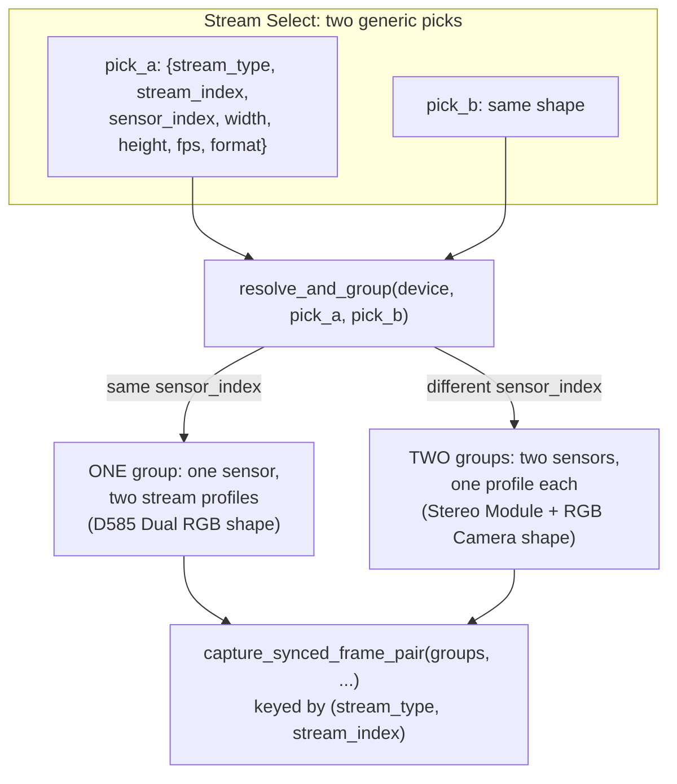

# CLAUDE.md

This file provides guidance to Claude Code (claude.ai/code) when working with code in this repository.

## What this is

A PySide6 desktop wizard app for measuring timing sync between ANY two video streams a connected Intel RealSense camera offers - two IR streams, IR+color, or two color streams on a Dual-RGB device - against an Image Engineering LED panel. It generalizes a sibling project that hardcoded a single IR-vs-RGB pairing (see "`resolve_and_group`..." below) into a wizard where the operator picks "Stream A" and "Stream B" from whatever the device actually reports. It replaces three standalone scripts (in the sibling `optical_sync_poc_/` directory, which this repo ports/lifts logic from) with one guided flow: Device Select -> Stream Config -> ROI Select -> Calibration -> Live Session.

## Commands

```powershell
# Setup (Windows, Python 3.10+, developed against 3.13)
python -m venv .venv
.venv\Scripts\pip install -r requirements.txt

# Run the full test suite (works with no hardware connected)
.venv\Scripts\python.exe -m pytest -v

# Run a single test
.venv\Scripts\python.exe -m pytest tests/domain/test_running_stats.py::test_mean_of_single_value -v

# Run the app (requires a connected RealSense camera + LED-Panel.exe on PATH past Device Select)
.venv\Scripts\python.exe main.py
```

`pytest.ini` sets `pythonpath = .` and `testpaths = tests`, so `pytest -v` from the repo root works without installing the package. GUI/widget tests construct real Qt objects; on a machine/CI runner with no display, set `QT_QPA_PLATFORM=offscreen` first (the GitHub Actions workflow in `.github/workflows/tests.yml` does this on `windows-latest`). Widget tests share one `QApplication` instance via the session-scoped `qapp` fixture in `tests/conftest.py`.

## Architecture

### Layering: `domain` -> `engine` -> `gui`, plus `state`

- **`domain/`** - pure image/math/calibration/export logic. No Qt, no `pyrealsense2`. Fully unit-tested with plain numpy arrays.
- **`engine/`** - hardware and live-session orchestration. Splits into a pure-Python core and a thin hardware/Qt shell:
  - `engine/metrics.py` (`PairingGapMetric`, `PositionGapMetric` - the `Metric` ABC), `engine/test_session.py` (`TestSession` - start/stop/buffers rows), `engine/acquisition_loop.py` (`AcquisitionLoop` - drives one frame-pair at a time through the metrics) are all pure Python, unit-tested with fakes.
  - `engine/streams.py` is hardware-facing and generic: `list_video_stream_options`/`list_video_stream_options_from_device` enumerate every infrared/color video-stream profile a device offers as plain picker dicts (no hardcoded "Stereo Module"/"RGB Camera" sensor-name filtering), `resolve_and_group` unifies the two-picks-into-sensors problem (see below), `capture_synced_frame_pair` drives one-shot settled captures (ROI select, calibration) off a `groups` list, and `ContinuousCapture(pick_a, pick_b)` drives the open-ended `rs.pipeline()`-based stream the live preview and live session both need. `engine/led_panel.py` (`LEDPanel`, a static-method wrapper around the `LED-Panel.exe` CLI) and `engine/session_engine.py` (`SessionEngineThread`, a `QThread`) round out the hardware-facing layer. All of `engine/streams.py`/`engine/led_panel.py`/`engine/session_engine.py` have no automated tests by design - see the "Live Session pipeline" section below and the README's Project Structure note.
- **`gui/`** - PySide6 wizard pages (`gui/pages/`) and reusable widgets (`gui/widgets/`), wired together by `gui/main_window.py` (`MainWindow`, a `QStackedWidget` driving the 5-page flow and persisting choices to `state.gui_state`).
- **`state/`** - `GuiState`, the wizard's own persisted state (`gui_state.json`: last device, `stream_a_*`/`stream_b_*` resolution/fps/ROI/camera-control fields). Separate from `settings.yaml` on purpose - see Configuration files below.

When extending a metric or the live session's data flow, start from `engine/metrics.py`/`engine/test_session.py` (pure, testable) and only touch `engine/session_engine.py` for the hardware/Qt plumbing.

### `resolve_and_group`: unifying "two sensors" and "one sensor, two streams"

Every stream pick (`engine/streams.py`'s `list_video_stream_options`) is a plain dict: `sensor_index`, `stream_type` (an `rs.stream` enum member - `infrared` or `color`), `stream_index`, `width`, `height`, `fps`, `format`. Stream Config produces two of these, `pick_a`/`pick_b`, entirely independently - nothing about the picker knows or cares whether they'll end up on the same physical sensor.

`resolve_and_group(device, pick_a, pick_b)` is the one function that resolves that question and unifies the two camera topologies this project subsumes as special cases:



If `pick_a`/`pick_b` share the same `sensor_index`, they resolve to ONE physical sensor object with two stream profiles opened on it together (the shape a D585-style Dual RGB camera needs - two color streams sharing a sensor). If they differ, they resolve to TWO distinct sensor objects (the traditional Stereo Module + RGB Camera shape - IR vs. color, or IR vs. IR on two separate stereo sensors). This matters because `sensor.open()`/`.start()` must be called once per distinct sensor object with all of that sensor's wanted profiles passed together, not once per stream pick. Everything downstream (`capture_synced_frame_pair`, camera-control application) works off this `groups` list, keyed internally by `(stream_type, stream_index)` tuples rather than `stream_type` alone, since two picks can share a stream type.

`gui/pages/stream_config_page.py`'s `group_camera_controls` mirrors this exact same-sensor-index grouping logic for UI layout purposes only, before any live device handle exists (it decides how many "Camera Controls" group boxes to show, purely from the two picks' `sensor_index` fields).

### Camera controls (emitter/exposure), applied once per resolved sensor

Camera controls - `set_emitter_enabled(sensor, enabled)`, `set_manual_exposure(sensor, exposure, gain)`, `enable_auto_exposure(sensor)`, all in `engine/streams.py` - are applied once PER DISTINCT RESOLVED SENSOR (i.e. once per `resolve_and_group` group), not once per stream pick, since two picks might share a sensor. Stream Config's UI presents one "Camera Controls" group box per `group_camera_controls` group: an IR-emitter-disable checkbox (shown only if the group includes an infrared stream) plus an auto/manual exposure+gain radio-button pair, read back as `camera_controls` (a list of `{sensor_indices, emitter_enabled, auto_exposure, exposure, gain}` dicts, position-aligned with `resolve_and_group`'s own group order) at "Next".

That `camera_controls` list is applied from three separate call sites, each of which re-derives `groups` via its own `resolve_and_group(device, pick_a, pick_b)` call and zips it against `camera_controls` position-for-position: `gui/pages/roi_select_page.py`'s `_apply_camera_controls` (used by both ROI Select and, imported directly, by `gui/pages/calibration_page.py`), and `engine/session_engine.py`'s `SessionEngineThread.run()` (duplicated inline rather than imported, since that file is hardware-thread code, not GUI code).

### Per-stream `config.yaml` slug keying

`config.yaml`'s LED positions are keyed per-stream by a slug (`engine/streams.py`'s `stream_slug(pick)`, e.g. `"infrared1"`, `"color"`, `"color2"` - `stream_index` 0 is omitted from the slug so a single-RGB camera's slug still just reads `"color"`) nested under the camera name, via `domain/calibration.py`'s `update_config_leds`/`load_led_positions`. This is simpler than a joined pair-key (e.g. `"infrared1_color"`): each stream's calibration data stands on its own, so recalibrating one stream of a pair doesn't invalidate the other's saved positions, and the same `"color"` slug's data is reusable across different Stream-A/Stream-B pairings that both happen to include it.

### Live Session pipeline (the core runtime loop)

`gui/pages/live_session_page.py`'s `start_session()` builds a `TestSession` (with `PairingGapMetric` + `PositionGapMetric`) and starts a `SessionEngineThread`. That thread's `run()` resolves `pick_a`/`pick_b` into sensor groups via `resolve_and_group`, applies camera controls per group, opens the RealSense sensors via `ContinuousCapture(pick_a, pick_b)`, puts the LED panel into scanning mode, then drives `engine.acquisition_loop.AcquisitionLoop.run_until_stopped()` in a plain Python loop - `AcquisitionLoop` calls `TestSession.process_pair()` per frame pair and invokes three callbacks (`on_frames`, `on_row`, `on_stats`), which `SessionEngineThread` re-emits as Qt signals (`frame_ready`, `row_ready`, `stats_ready`, `session_finished`, `error`) to cross into the GUI thread safely.

Two callback cadences matter and must stay separate:
- **`row_ready`/`on_row` fires on every single frame pair**, unthrottled. `LiveSessionPage._on_row_ready` must stay O(1) - only cheap counter/accumulator updates (`stream_a_frame_drop`/`stream_b_frame_drop` counts, `domain.running_stats.RunningStats`). It must NOT call `LivePlot.add_point()`/pyqtgraph `setData()` here - that was tried and caused a real GUI freeze (a continuously growing backlog of queued cross-thread Qt signal work that only became visible when the user tried to interact with the window).
- **`stats_ready`/`on_stats` fires only every `display_stride` pairs** (default 10, set in `AcquisitionLoop`/`SessionEngineThread`, and live-editable per run via Live Session's own toolbar spinbox). This is where plot updates (`LivePlot.add_point`) and stat-tile pushes happen - the rate the GUI thread can actually sustain, matching the same cadence the video panels update on.

`SessionEngineThread.finished` (Qt's own built-in signal, fired only after `run()` fully returns including its `finally` block) - not `session_finished`/`error` - is what re-enables the Start button. Gating on `session_finished` instead would let a new session's camera/LED-panel calls race the old thread's still-in-progress hardware cleanup.

### Naming: UI labels vs. data keys are intentionally decoupled

The live session UI shows "HW TS Latency" and "Optical Sync" as user-facing names, but the underlying `Metric.name`/dict keys/CSV columns are still `pairing_gap_us` and `position_gap_ms` throughout `engine/`, `domain/csv_export.py`, and `gui/widgets/stats_panel.py`'s field keys. Only display text (checkbox labels, chart axis titles, `LivePlot.add_series`'s `display_name` param, stat tile labels) uses the renamed terms. This same UI-label-vs-data-key gap also applies to the generalized per-stream naming: the CSV/row columns are `stream_a_frame_drop`/`stream_b_frame_drop` (singular, from `engine/metrics.py`'s `PositionGapMetric`), but `stats_panel.py`'s live tiles and `LivePlot`'s drop-count series both use `stream_a_frame_drops`/`stream_b_frame_drops` (plural - a separately-tracked running count, not a copy of the row column). Don't assume a UI label - or even one data-layer key - matches another data-layer key when tracing a value back through the pipeline.

### `gui/widgets/live_plot.py` gotcha

`LivePlot` subclasses `pg.PlotWidget`. Its own `clear()`-style method must be called `clear_data()`, not `clear()` - `pg.PlotWidget.__init__` copies several of its own methods (including `clear`) onto the *instance* itself, which in Python takes priority over a same-named method defined on the subclass, silently shadowing it. `add_series(name, color, display_name=None)` keeps `name` as the lookup key used everywhere (`add_point`, `get_series_data`, `set_series_visible`) and `display_name` as an independent, optional legend label.

### Configuration files (three, different purposes)

- **`settings.yaml`** - the one hand-edited file (camera defaults under `camera.stream_a`/`camera.stream_b`, calibration tuning, live-test tuning). Nothing in the app writes to it.
- **`config.yaml`** - auto-generated by the Calibration wizard step, overwritten wholesale per camera model on every calibration run, with LED positions keyed per-stream-slug within that camera (`domain/calibration.py`'s `update_config_leds`/`load_led_positions` - see "Per-stream `config.yaml` slug keying" above). Never hand-edit.
- **`gui_state.json`** - the wizard's own last-used choices (`state/gui_state.py`'s `GuiState`: `device_serial` plus `stream_a_*`/`stream_b_*` type/index/width/height/fps/roi/emitter_enabled/auto_exposure/exposure/gain), gitignored, machine-specific. This is deliberately a lossy, JSON-friendly prefill record for the NEXT app launch's Stream Config defaults - it does NOT store `format`/`sensor_index`, so it can't reconstruct a full pick on its own. Within one running wizard session, `gui/main_window.py`'s `MainWindow` instead keeps the live `pick_a`/`pick_b`/`camera_controls` values as its own instance attributes (`self._pick_a`/`self._pick_b`/`self._camera_controls`), separately from anything persisted to `GuiState`.

### Output

Everything a live session or calibration produces lands under `output/` (created automatically): raw/frame-drop CSVs (`domain/csv_export.py`), a static end-of-session plot (`domain/plot_export.py`, matplotlib with the `Agg` backend), and LED on/off debug snapshot PNGs (both periodic-during-run and on-demand via "Save Debug Snapshot"). Filenames use `stream_a`/`stream_b` (e.g. `live_led_state_stream_a.png`, `periodic_led_state_stream_a_pair00020.png`) except calibration's debug detection images, which use each pick's own slug instead (e.g. `debug_infrared1_detection.png`, `debug_color_detection.png`) since two different stream-pair calibration runs on the same camera share that per-slug identity rather than an arbitrary "which page of the wizard was A vs. B" one.
